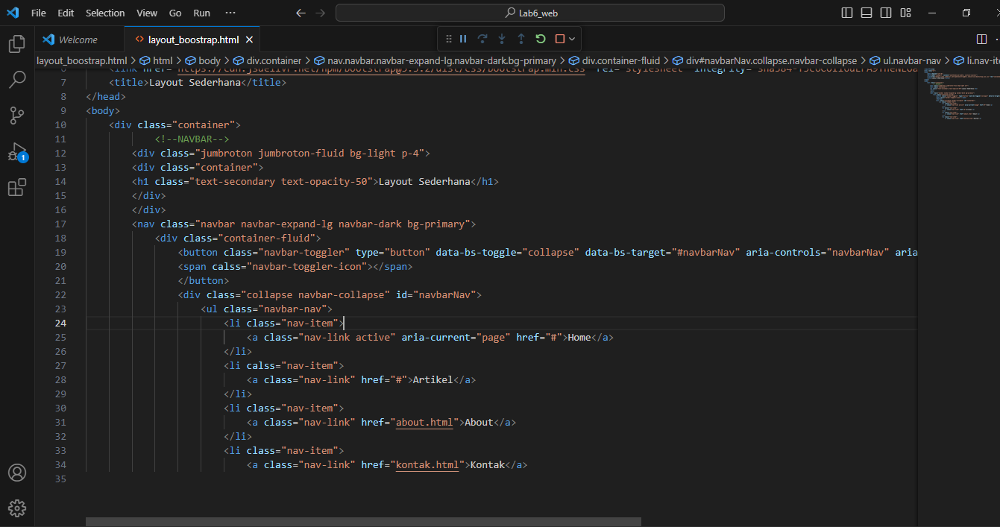
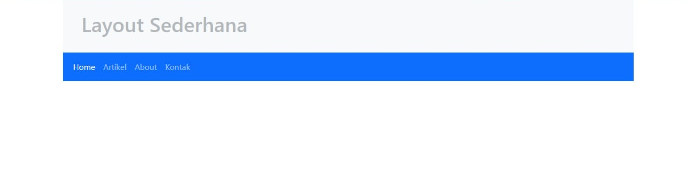
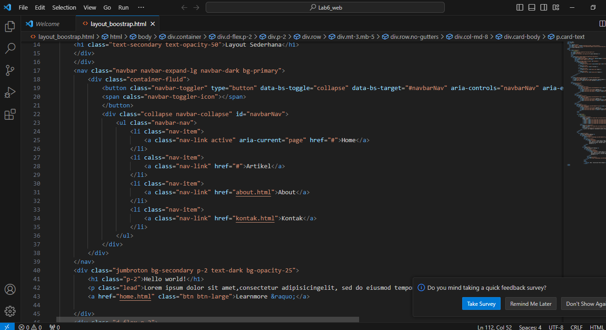
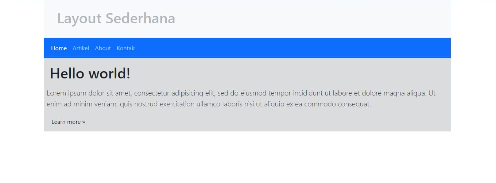
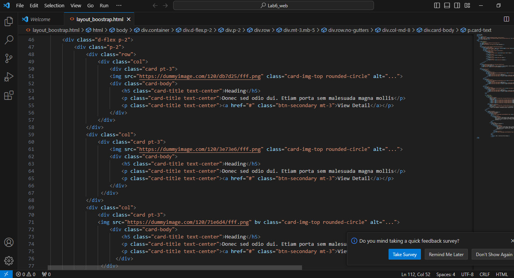
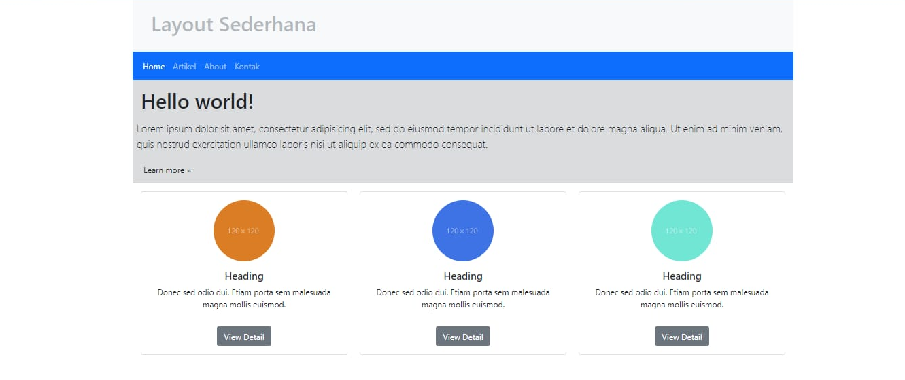
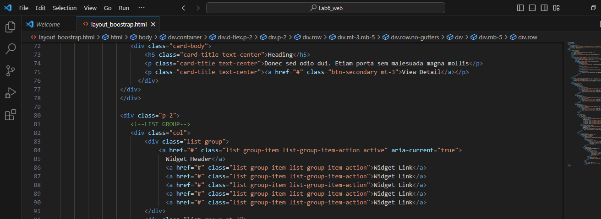
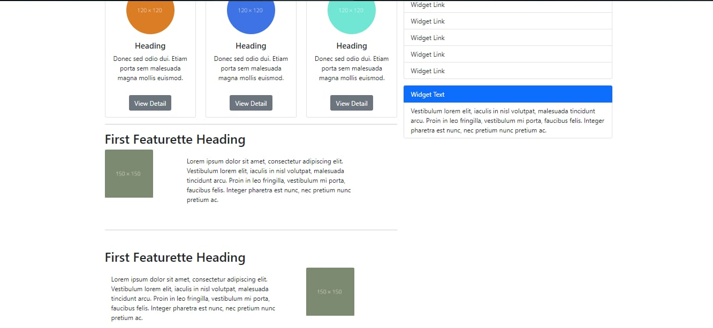
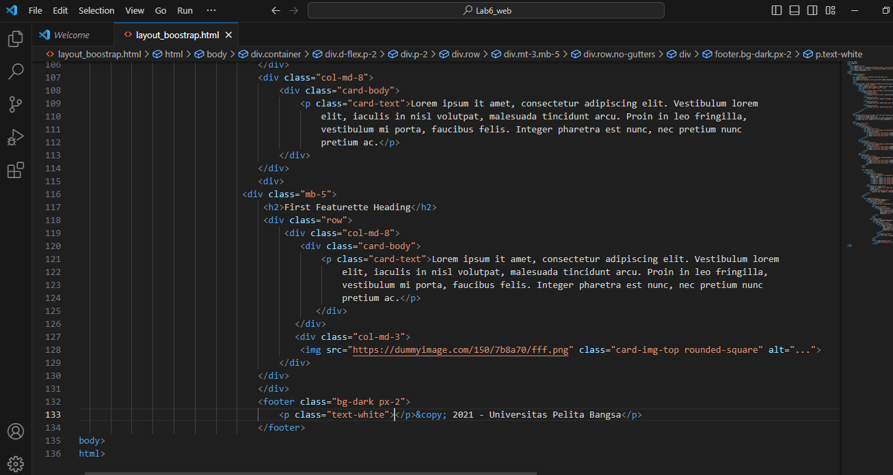
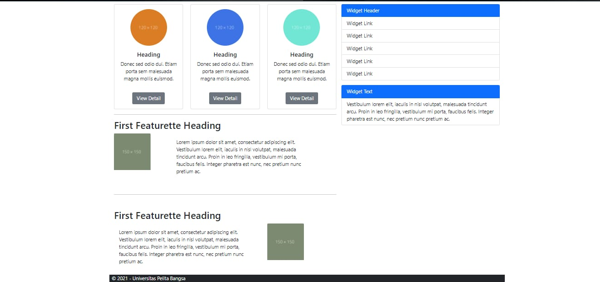

# LANGKAH - LANGKAH PRAKTIKUM 

- Membuat layout awalan dengan menggunakan seperti ini

- Membuat isiin pada halaman layout

- membuat gamabr 3 warna 

- Membuat widget pada halaman 

- membuat tambahan first featurette dan footer

